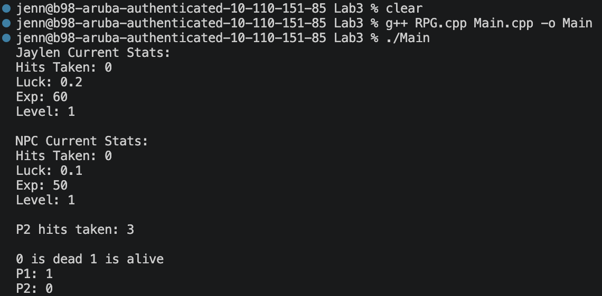

# Role Playing Game Part One

## GitHub Link

https://github.com/Jromero1907/Object-Oriented-Programming/tree/main/Lab3

## Completion Checklist

### RPG Class

- [x] `RPG.h` completed
- [x] `RPG.cpp` completed
- [x] Private member variables implemented
- [x] Default constructor implemented
- [x] Parameterized constructor implemented
- [x] Destructor implemented
- [x] Getter functions implemented
- [x] `setHitsTaken()` implemented
- [x] `isAlive()` implemented

### Testing

- [x] Created and tested multiple `RPG` objects
- [x] Tested the constructors
- [x] Tested the getter functions
- [x] Tested `setHitsTaken()`
- [x] Tested `isAlive()`
- [x] Program compiles without errors
- [x] Program runs correctly

## Program Output

